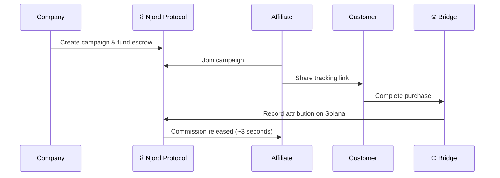
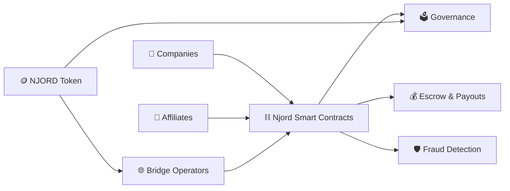

<p align="center">
  
</p>

<h1 align="center">Njord Protocol</h1>

<h3 align="center"><em>Where Every Click Pays. Instantly. On-Chain.</em></h3>

<p align="center">
  <a href="https://explorer.solana.com/address/Hm5WfS2KL4UPaUqVJ3vadCuPMCftw2oybqvpDr7fn9Hv?cluster=devnet"></a>
  <a href="LICENSE"></a>
  <a href="https://njord.cryptuon.com"></a>
  
  
</p>

---

Njord is a decentralized affiliate marketing protocol on **Solana** that replaces opaque middlemen with transparent smart contracts. Companies fund campaigns with on-chain escrow, affiliates earn commissions settled in seconds, and independent bridge operators bring the whole world in through fiat on/off ramps.

**No more NET-90 payment terms. No more black-box tracking. No more trust issues.**

---

## The Problem with Affiliate Marketing Today

- **Slow payments** — Affiliates wait 30–90 days to get paid
- **Opaque tracking** — Proprietary dashboards with no way to verify numbers
- **High fees** — Networks take 15–30% of every commission
- **Fraud with no accountability** — Bad actors thrive, honest participants suffer
- **Regional gatekeeping** — KYC-heavy platforms lock out global talent

---

## How Njord Works



---

## Who Is Njord For?

<table>
<tr>
<td width="33%" valign="top">

### For Campaign Owners

- Pay **only for verified results**
- On-chain escrow protects your budget
- Built-in fraud detection & challenge system
- Real-time analytics on every conversion
- Stake NJORD for up to 50% fee discounts

</td>
<td width="33%" valign="top">

### For Affiliates

- Commissions in **seconds, not months**
- Build reputation → unlock faster payouts
- No middlemen, no platform lock-in
- Browse campaigns & generate links instantly
- Earn in USDC or withdraw to bank via bridge

</td>
<td width="33%" valign="top">

### For Bridge Operators

- **Earn fees on every transaction** you process
- Stake NJORD for higher volume tiers
- Multiple revenue streams (fees + staking + spread)
- Run infrastructure in any region
- Plug-and-play SDK with Docker deployment

</td>
</tr>
</table>

---

## Why Njord?

| | Traditional Networks | Njord Protocol |
|---|---|---|
| **Payment Speed** | 30–90 days | ~3 seconds |
| **Transparency** | Proprietary dashboards | On-chain, fully auditable |
| **Platform Fee** | 15–30% | 2.5% protocol + 1% bridge |
| **Fraud Handling** | Manual review, weeks | Automated scoring + economic challenges |
| **Global Access** | Regional, KYC-heavy | Permissionless + optional bridge KYC |
| **Trust Model** | "Trust the network" | Trustless smart contracts |
| **Settlement** | Bank transfers | Direct USDC to wallet |

---

## Key Numbers

| Metric | Value |
|--------|-------|
| Settlement time | **~3 seconds** |
| Transaction cost | **~$0.00025** |
| Protocol fee | **2.5%** |
| Total NJORD supply | **1,000,000,000** |
| Affiliate tiers | **4** (New → Verified → Trusted → Elite) |
| Bridge tiers | **4** (Bronze → Silver → Gold → Platinum) |

---

## Ecosystem



---

## Get Started

| I want to... | Go here |
|-------------|---------|
| Explore the network | [**Dashboard** →](https://njord.cryptuon.com) |
| Read the full documentation | [**Documentation** →](documentation/docs/index.md) |
| Understand how it works | [How It Works →](documentation/docs/how-it-works.md) |
| Start as an affiliate | [For Affiliates →](documentation/docs/for-affiliates.md) |
| Launch a campaign | [For Companies →](documentation/docs/for-companies.md) |
| Run a bridge | [For Bridge Operators →](documentation/docs/for-bridge-operators.md) |
| Understand the token | [Tokenomics →](documentation/docs/tokenomics.md) |

---

## Packages

| Package | Description |
|---------|-------------|
| [`@njord/sdk`](packages/sdk) | Core TypeScript SDK for protocol interaction |
| [`@njord/react`](packages/react) | React hooks and components for frontend apps |
| [`@njord/bridge-sdk`](packages/bridge-sdk) | SDK for building bridge operator services |
| [`@njord/indexer`](packages/indexer) | Event indexer with GraphQL API |

---

## Deployment

| Network | Program ID | Status |
|---------|-----------|--------|
| **Devnet** | [`Hm5WfS2KL4UPaUqVJ3vadCuPMCftw2oybqvpDr7fn9Hv`](https://explorer.solana.com/address/Hm5WfS2KL4UPaUqVJ3vadCuPMCftw2oybqvpDr7fn9Hv?cluster=devnet) | Live |
| **Mainnet** | `Hm5WfS2KL4UPaUqVJ3vadCuPMCftw2oybqvpDr7fn9Hv` | Pending |

---

## Quick Start (Developers)

```bash
git clone https://github.com/njord-protocol/njord.git
cd njord
pnpm install
pnpm build
```

For detailed setup, deployment, and API documentation, see the [Developer Guide](njord-docs/docs/getting_started.md).

---

## Contributing

Contributions are welcome. See [CONTRIBUTING.md](CONTRIBUTING.md) for guidelines.

For security concerns, email support@cryptuon.com or open a private security advisory.

---

## License

[MIT](LICENSE)
