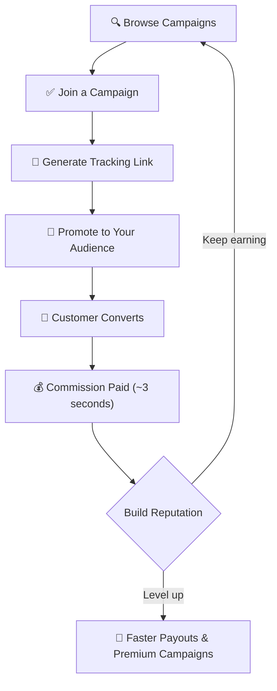

# For Affiliates

**Earn commissions by promoting products you believe in. Get paid in seconds, not months.**

---

## How It Works for You

1. **Browse Campaigns** — Explore active campaigns from companies. Filter by category, commission rate, and requirements.
2. **Join & Get Your Link** — Join a campaign to receive your unique affiliate tracking link.
3. **Promote** — Share through your blog, social media, videos, newsletter, or any channel.
4. **Earn Instantly** — When a customer converts, your commission is calculated and paid automatically from the on-chain escrow.

---

## The Tier System

Build your reputation over time to unlock faster settlements and premium campaigns.

| Tier | Stake Required | Hold Period | Campaign Access |
|------|---------------|-------------|-----------------|
| **New** | None | 7 days | Open campaigns only |
| **Verified** | 100 NJORD | 3 days | Standard campaigns |
| **Trusted** | 1,000 NJORD | 24 hours | Premium campaigns |
| **Elite** | 10,000 NJORD | Real-time | All campaigns |

!!! info "What's a hold period?"
    The hold period is the time between when a conversion is recorded and when your commission is released. It exists to protect against fraud. As you build trust, your hold period decreases — Elite affiliates get paid instantly.

---

## Who Can Be an Affiliate?

| Type | Examples |
|------|---------|
| Content Creators | YouTubers, bloggers, podcasters |
| Influencers | Social media personalities |
| Comparison Sites | Review and comparison platforms |
| Coupon/Deal Sites | Discount aggregators |
| Email Marketers | Newsletter operators |
| App Developers | In-app promotions |

---

## Getting Started

=== "With a Crypto Wallet"

    1. **Install a Solana wallet** — [Phantom](https://phantom.app), [Solflare](https://solflare.com), or [Backpack](https://backpack.app)
    2. **Get a small amount of SOL** — Transfer ~0.01 SOL from an exchange for transaction fees
    3. **Connect to Njord** — Visit the [Dashboard](https://njord.cryptuon.com) and click "Connect Wallet"
    4. **Browse campaigns** — Explore available campaigns and join ones that match your audience
    5. **Generate your link** — Copy your unique tracking link and start promoting
    6. **Track & withdraw** — Monitor earnings in real-time and withdraw anytime

=== "Without Crypto (Via Bridge)"

    1. **Choose a bridge operator** — Select one operating in your region
    2. **Sign up** — Create an account and verify if required
    3. **Browse & join campaigns** — Use the bridge interface to find and join campaigns
    4. **Promote & earn** — Generate links and track performance
    5. **Withdraw to bank** — Request fiat withdrawal; the bridge converts USDC to your local currency

!!! tip "No crypto experience needed"
    Bridge operators handle all the blockchain complexity. You can earn and withdraw in your local currency without ever touching a crypto wallet.

---

## How You Get Paid

When a customer converts through your link:

| Item | Amount |
|------|--------|
| Customer purchase | $100.00 |
| Your commission (10%) | $10.00 |
| Protocol fee (2.5%) | -$0.25 |
| Bridge fee (1%) | -$0.10 |
| **You receive** | **$9.65** |

Commissions are paid in USDC (or SOL) directly to your wallet. Via bridge, you can convert to local currency.

---

## Tips for Success

- **Disclose affiliate relationships** — Be transparent with your audience
- **Focus on quality traffic** — High conversion rates build your reputation faster
- **Avoid fraud** — Self-referrals, bot traffic, and fake signups result in stake slashing and bans
- **Stake to level up** — Even a small stake moves you from New to Verified, cutting your hold period from 7 days to 3

---

## Related Pages

- [How It Works](how-it-works.md) — Full protocol flow
- [Fraud Protection](fraud-protection.md) — Understanding the challenge system
- [Tokenomics](tokenomics.md) — NJORD token and staking
- [FAQ](faq.md) — Common questions answered
