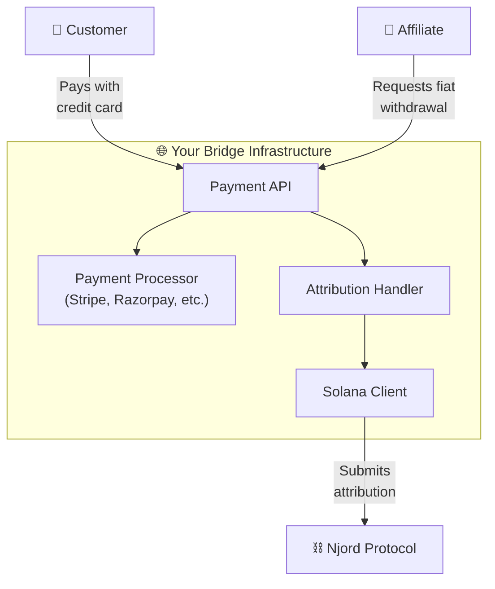
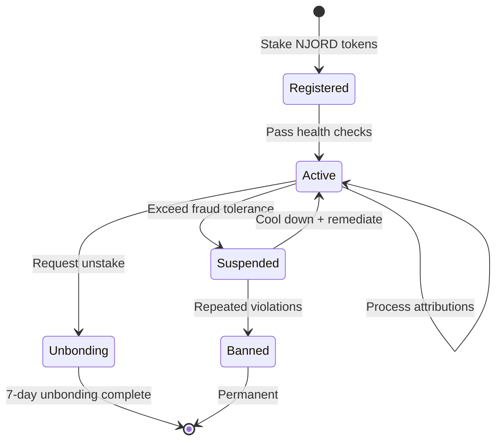

# For Bridge Operators

**Power the future of affiliate marketing. Run payment infrastructure, earn fees on every transaction.**

Bridge operators are the backbone of mainstream adoption. You run the infrastructure that connects fiat payments to on-chain settlement.

---

## What You Do

1. **Accept fiat payments** — Process credit cards, bank transfers, UPI, and local payment methods from customers
2. **Submit attributions on-chain** — Convert fiat transactions to on-chain attribution events on Solana
3. **Facilitate withdrawals** — Help affiliates convert crypto earnings back to local currency
4. **Detect fraud** — Run detection infrastructure to prevent fraudulent attributions

---

## Bridge Tiers

Higher stakes unlock higher volume limits and better routing priority.

| Tier | Min Stake | Daily Volume Cap | Fraud Tolerance |
|------|-----------|-----------------|-----------------|
| **Bronze** | 10,000 NJORD | $10,000 | < 2% dispute rate |
| **Silver** | 50,000 NJORD | $100,000 | < 1% dispute rate |
| **Gold** | 200,000 NJORD | $1,000,000 | < 0.5% dispute rate |
| **Platinum** | 500,000 NJORD | Unlimited | < 0.25% dispute rate |

---

## Revenue Streams

| Stream | Description | Example |
|--------|-------------|---------|
| **Attribution Fees** | 1% of commissions processed through your bridge | $1M monthly volume = **$10,000/month** |
| **Staking Rewards** | Pro-rata share of protocol inflation rewards | 30% of protocol fees distributed to stakers |
| **Conversion Spread** | Your fiat-to-crypto conversion rate (typically 0.5–2%) | $100 converted = $0.50–$2.00 |
| **Withdrawal Fees** | Per-withdrawal or percentage when affiliates cash out | $1 flat or 0.5% per withdrawal |

---

## Bridge Operator Lifecycle

---

## Setup Guide

### Prerequisites

- **Technical**: Server infrastructure, Node.js/TypeScript experience, payment gateway integration knowledge
- **Financial**: NJORD tokens for staking (min 10,000), SOL for transaction fees, settlement liquidity
- **Legal**: Business entity, payment processor relationships, local compliance

### Steps

1. **Acquire & stake NJORD tokens** — Purchase from a DEX (Raydium, Orca) and stake to register as a bridge operator
2. **Deploy infrastructure** — Clone the bridge SDK, configure environment, deploy with Docker
3. **Integrate payment provider** — Connect Stripe, Razorpay, or other local gateway API keys
4. **Configure & register** — Set your fees, region, and supported payment methods; register on-chain
5. **Start processing** — Begin handling attribution events; monitor your dashboard for volume and reputation

!!! warning "Strict liability"
    Bridges are slashed for any fraudulent attribution they submit, regardless of intent. Invest in detection infrastructure to protect your stake. See [Fraud Protection](fraud-protection.md) for details.

---

## Slashing Conditions

| Offense | Penalty |
|---------|---------|
| Per fraudulent attribution | 5% of attribution value (min 10 USDC) |
| Exceeds fraud tolerance | 10% stake slash + tier downgrade |
| Repeated violations | 50% slash + 30-day suspension |
| Proven collusion | 100% slash + permanent ban |

---

## Example Bridge Operators

| Operator | Region | Payment Methods |
|----------|--------|----------------|
| Bridge Alpha | US/EU | Stripe, Bank Transfer |
| Bridge Beta | India | Razorpay, UPI, Paytm |
| Bridge Gamma | LATAM | MercadoPago, PIX |
| Bridge Delta | SEA | GrabPay, GCash |

---

## Related Pages

- [Tokenomics](tokenomics.md) — Staking economics and rewards
- [Fraud Protection](fraud-protection.md) — Detection requirements and slashing
- [How It Works](how-it-works.md) — Full protocol flow
- [Roadmap](roadmap.md) — Bridge infrastructure development timeline
