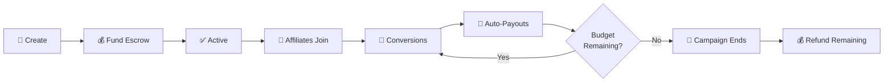

# For Companies

**Launch transparent, results-driven campaigns. Only pay for verified conversions.**

---

## Why Njord?

| Benefit | How |
|---------|-----|
| **Pay for results only** | Commissions are only released from escrow on verified conversions |
| **On-chain transparency** | Every attribution and payout is recorded on Solana, fully auditable |
| **Built-in fraud protection** | Automated scoring + economic challenge system catches bad actors |
| **Global reach** | Bridge operators in multiple regions enable fiat payments worldwide |

---

## Campaign Lifecycle

---

## Campaign Configuration

When you create a campaign, you define:

| Parameter | Description | Example |
|-----------|-------------|---------|
| **Budget** | Total amount for affiliate payouts | 10,000 USDC |
| **Commission Type** | How commissions are calculated | Percentage, Flat, or Tiered |
| **Commission Rate** | The rate affiliates earn | 10% of sale value |
| **Target Action** | What triggers a commission | Purchase, Signup, App Install, Subscription |
| **Attribution Model** | How credit is assigned | Last Click or First Click |
| **Min Affiliate Tier** | Minimum reputation required | New, Verified, Trusted, or Elite |
| **Hold Period** | Time before commission release | 0–7 days (customizable) |
| **Auto-Approve** | Whether affiliates need approval | Yes or No |

!!! note "Optimized for digital products"
    Njord is designed for digital products and services (SaaS, apps, subscriptions, digital content) where instant delivery eliminates return/refund complexity.

---

## Fee Structure

Simple, transparent fees on successful conversions only:

| Item | Amount |
|------|--------|
| Customer purchases | $100.00 |
| Commission rate (10%) | $10.00 |
| Protocol fee (2.5% of commission) | -$0.25 |
| Bridge fee (1% of commission) | -$0.10 |
| **Affiliate receives** | **$9.65** |

!!! tip "Stake NJORD for fee discounts"
    | Stake | Discount |
    |-------|----------|
    | 5,000 NJORD | 10% off protocol fees |
    | 25,000 NJORD | 25% off |
    | 100,000 NJORD | 50% off |

---

## Getting Started

=== "Crypto-Native"

    1. **Install a Solana wallet** — Phantom, Solflare, or Backpack
    2. **Fund with USDC or SOL** — Transfer from an exchange
    3. **Connect to Njord** — Visit the [Dashboard](https://njord.cryptuon.com)
    4. **Create your campaign** — Set parameters and fund the escrow

=== "Via Bridge (Fiat)"

    1. **Choose a bridge operator** in your region
    2. **Create an account** on the bridge platform
    3. **Configure your campaign** through the bridge dashboard
    4. **Pay with credit card or bank transfer** — the bridge handles on-chain deployment

---

## Commission Models

| Model | How It Works | Best For |
|-------|-------------|----------|
| **Percentage** | % of sale value (e.g., 10% of $100 = $10) | E-commerce, SaaS |
| **Flat** | Fixed amount per action (e.g., $5 per signup) | Lead generation |
| **Tiered** | Rates increase with volume | High-volume affiliates |

---

## What You Control

- Pause or end campaigns at any time
- Set minimum affiliate tier requirements
- Customize hold periods per campaign
- Choose auto-approve or manual approval for affiliates
- Challenge suspicious attributions (see [Fraud Protection](fraud-protection.md))
- Withdraw unused budget when the campaign ends

---

## Related Pages

- [How It Works](how-it-works.md) — Full protocol flow
- [For Affiliates](for-affiliates.md) — Understanding your affiliates
- [Fraud Protection](fraud-protection.md) — Built-in safety mechanisms
- [Tokenomics](tokenomics.md) — Fee discounts through staking
