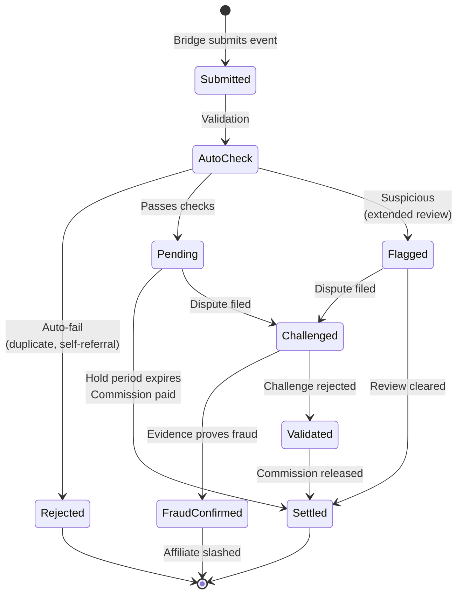
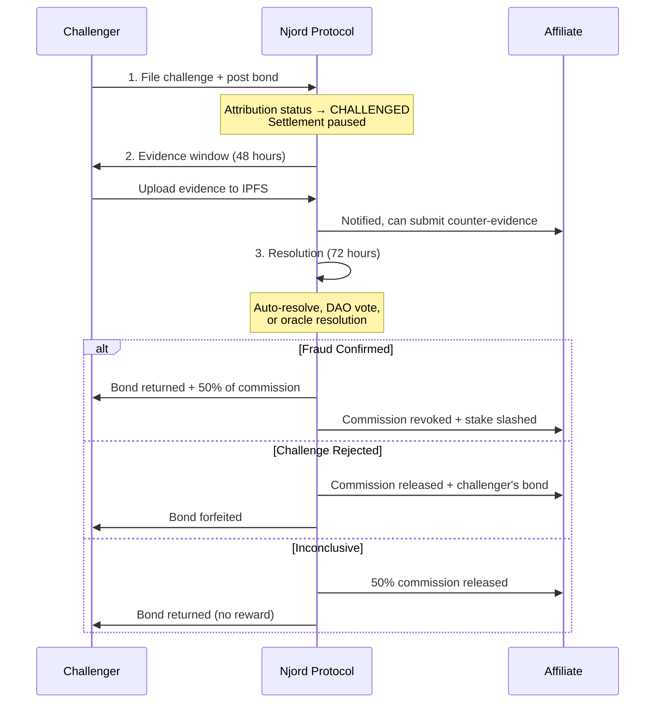

# Fraud Protection

Njord makes fraud economically irrational. Every participant stakes value, catching fraud is rewarded, and bad actors lose more than they could ever gain.

---

## Design Principles

| Principle | How |
|-----------|-----|
| **Skin in the Game** | All participants stake value, creating accountability |
| **Profitable Detection** | Catching fraud is financially rewarded |
| **Decentralized Validation** | Multiple parties can challenge, not just the network |
| **Economic Deterrence** | Fraud costs more than potential gains |
| **Speed vs Security** | Higher trust = faster settlement |

---

## Attribution Lifecycle

Every conversion goes through this state machine before commission is released:

---

## Affiliate Tiers & Hold Periods

Affiliates build trust through staking and track record:

| Tier | Stake | History Required | Hold Period | Campaign Access |
|------|-------|-----------------|-------------|-----------------|
| **New** | 0 | < 30 days | 7 days | Open campaigns |
| **Verified** | 100 NJORD | 30+ days, 10+ conversions | 3 days | Standard campaigns |
| **Trusted** | 1,000 NJORD | 90+ days, 100+ conversions, < 1% dispute | 24 hours | Premium campaigns |
| **Elite** | 10,000 NJORD | 180+ days, 1000+ conversions, < 0.5% dispute | Real-time | All campaigns |

---

## Challenge System

### Who Can Challenge?

| Challenger | Can Challenge | Bond Required |
|-----------|--------------|---------------|
| **Company** | Their own campaign attributions | 5% of commission (min $5) |
| **Bridge Operator** | Any attribution they processed | 10% of commission (min $10) |
| **Other Affiliate** | Same-campaign attributions | 15% of commission (min $15) |
| **Protocol (auto)** | Any attribution | No bond required |

### Challenge Flow

### Outcomes

| Outcome | Affiliate | Challenger | Company |
|---------|-----------|------------|---------|
| **Fraud Confirmed** | Loses commission + stake slash | Bond back + 50% of commission | 50% refunded to escrow |
| **Challenge Rejected** | Gets commission + challenger's bond | Loses bond | No change |
| **Inconclusive** | Gets 50% commission | Bond returned | 50% refunded |

!!! warning "False accusations are penalized"
    Filing frivolous challenges costs you your bond. The system incentivizes only legitimate disputes.

---

## Fraud Scoring

Every attribution receives a score from 0–100 based on multiple signals:

| Score Range | Classification | Action |
|------------|----------------|--------|
| **0–20** | Clean | Auto-approve, fast settlement |
| **20–50** | Normal | Standard hold period |
| **50–80** | Suspicious | Extended hold + manual review |
| **80–100** | High Risk | Auto-reject or require verification |

Scoring factors include: velocity patterns, duplicate detection, affiliate history, bridge reputation, and behavioral analysis.

---

## Common Fraud Scenarios

??? example "Cookie Stuffing"
    **Attack:** Hidden iframes dropping cookies on unsuspecting users.

    **Detection:** Low click-to-conversion time (< 1 second), high volume with low engagement, IP/session mismatches.

    **Response:** Auto-flagged by bridge, challenged by company, affiliate stake slashed.

??? example "Fake Signups"
    **Attack:** Creating fake accounts to earn per-signup commissions.

    **Detection:** Disposable email domains, phone verification failure, no subsequent engagement.

    **Response:** Require verified email/phone for signup campaigns, pay on activation not signup.

??? example "Bot Traffic"
    **Attack:** Using bots to generate fake clicks or signups.

    **Detection:** Device fingerprint anomalies, inhuman behavioral patterns, data center IP clustering.

    **Response:** Bridge rejects submission. If submitted, both affiliate and bridge slashed.

??? example "Collusion (Affiliate + Bridge)"
    **Attack:** Bridge operator and affiliate collude to submit fake attributions.

    **Detection:** Cross-bridge comparison, unusual volume spikes, company transaction record mismatch.

    **Response:** Both affiliate and bridge slashed under strict liability. Bridge permanently banned.

---

## Affiliate Slashing Schedule

| Offense | First | Second | Third |
|---------|-------|--------|-------|
| Lost challenge | 10% stake | 25% stake | 100% + ban |
| Proven malicious fraud | 50% stake | 100% + ban | — |
| Self-referral | 25% stake | 50% stake | 100% + ban |
| Bot/fake traffic | 30% stake | 60% stake | 100% + ban |

---

## Related Pages

- [For Affiliates](for-affiliates.md) — Tier system and reputation building
- [For Bridge Operators](for-bridge-operators.md) — Bridge slashing conditions
- [Tokenomics](tokenomics.md) — Staking economics
- [How It Works](how-it-works.md) — Protocol flow overview
