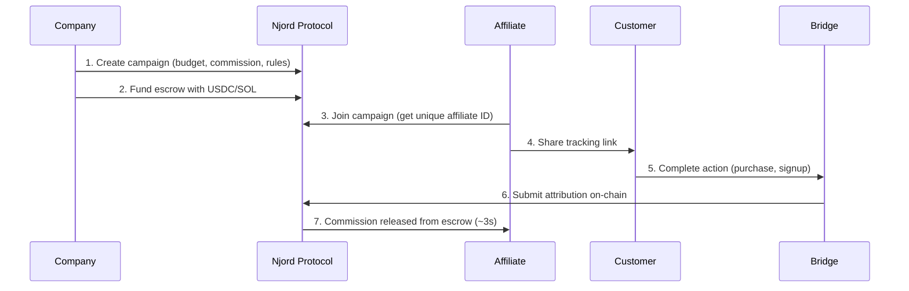
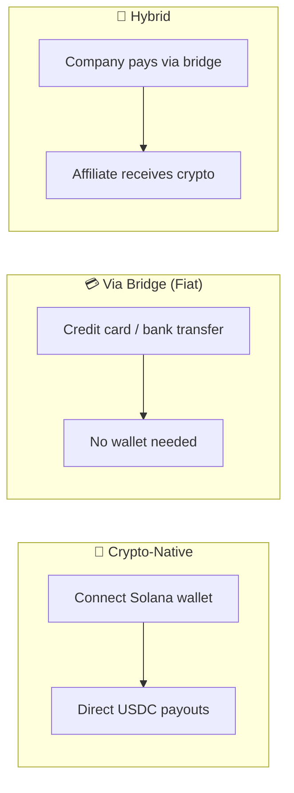

# How It Works

Njord brings affiliate marketing on-chain. Companies fund campaigns, affiliates promote products, and commissions are paid automatically — all settled on Solana in seconds.

---

## The Protocol Flow

---

## Step by Step

### 1. Create Campaign
A company creates a new campaign on-chain, defining the budget, commission structure (percentage, flat fee, or tiered), target action (purchase, signup, app install), and affiliate requirements.

### 2. Fund Escrow
The company deposits USDC or SOL into a secure on-chain escrow tied to the campaign. Funds stay locked until distributed to affiliates or the campaign ends.

### 3. Affiliate Joins
Affiliates browse available campaigns and join ones that match their audience. They receive a unique affiliate ID for tracking conversions.

### 4. Share & Promote
Affiliates generate tracking links and share them through blogs, social media, videos, newsletters, or any channel. Multiple tracking methods are supported:

| Method | Format | Best For |
|--------|--------|----------|
| URL Parameter | `?njord=CAMPAIGN.AFFILIATE` | Web links |
| Short Link | `njord.link/CAMPAIGN/AFFILIATE` | Social media |
| Coupon Code | `AFFILIATE10` | Checkout flows |
| SDK Embed | JavaScript snippet | In-app tracking |

### 5. Customer Acts
A customer clicks the affiliate link and completes the target action — makes a purchase, signs up, installs an app. The experience is seamless; customers don't need a crypto wallet.

### 6. Record Attribution
The bridge operator (or company SDK) submits the conversion event to the Solana blockchain. The smart contract validates the campaign, affiliate registration, and escrow balance.

### 7. Commission Paid
The smart contract automatically calculates the commission and releases it from escrow to the affiliate's wallet, minus a small protocol fee (2.5%) and bridge fee (1%).

!!! tip "Real-Time Settlement"
    From purchase to commission in approximately **3 seconds**:

    | Time | Event |
    |------|-------|
    | T+0s | Customer clicks "Buy" |
    | T+2s | Payment confirmed by bridge |
    | T+2.5s | Attribution submitted to Solana |
    | T+3s | Transaction confirmed, commission released |

---

## Three Ways to Participate

**Crypto-Native** — For users with Solana wallets. Connect directly, fund campaigns or receive commissions in USDC/SOL.

**Via Bridge (Fiat)** — For mainstream users. Pay and get paid in local currency through bridge operators. No wallet required.

**Hybrid** — The most common setup. Companies pay via bridge, affiliates receive crypto directly. Best of both worlds.

---

## What Happens When Things Go Wrong

| Scenario | How Njord Handles It |
|----------|---------------------|
| Insufficient escrow | Transaction reverts, no commission created |
| Duplicate conversion | Idempotency check prevents double-payment |
| Invalid affiliate | Transaction reverts |
| Bridge offline | Events queued, submitted when back online |
| Campaign expired | New events rejected automatically |
| Suspected fraud | [Challenge system](fraud-protection.md) activates |

---

## Related Pages

- [For Affiliates](for-affiliates.md) — Start earning commissions
- [For Companies](for-companies.md) — Launch your first campaign
- [For Bridge Operators](for-bridge-operators.md) — Run payment infrastructure
- [Fraud Protection](fraud-protection.md) — How disputes are handled
