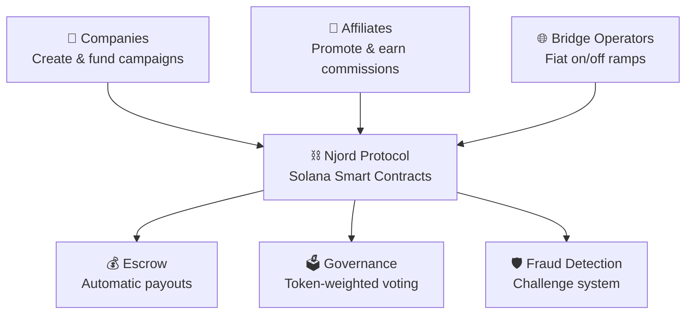

# Welcome to Njord Protocol

**Where Every Click Pays. Instantly. On-Chain.**

Njord is a decentralized affiliate marketing protocol built on Solana that connects companies, affiliates, and bridge operators in a transparent, trustless ecosystem. Campaigns are funded on-chain, conversions are tracked immutably, and commissions are paid in seconds — not months.

---

## The Ecosystem

---

## Choose Your Path

| I'm a... | I want to... | Start here |
|-----------|-------------|------------|
| **Campaign Owner** | Launch transparent, results-driven campaigns | [For Companies](for-companies.md) |
| **Affiliate** | Earn commissions promoting products I believe in | [For Affiliates](for-affiliates.md) |
| **Bridge Operator** | Run payment infrastructure and earn fees | [For Bridge Operators](for-bridge-operators.md) |
| **Investor** | Understand the token economics | [Tokenomics](tokenomics.md) |

---

## Why Solana?

| Factor | Benefit |
|--------|---------|
| ~400ms finality | Real-time attribution tracking |
| ~$0.00025 per transaction | Economical micro-commissions |
| 65,000 TPS capacity | Scale to millions of conversions |
| Rich ecosystem | USDC, wallet infrastructure, DEXs |

---

## Key Terms

| Term | Definition |
|------|-----------|
| **Campaign** | A marketing initiative with defined budget, commission rates, and attribution rules deployed on-chain |
| **Attribution** | The on-chain record tracking which affiliate drove a specific customer action |
| **Escrow** | Smart contract-held funds that automatically distribute to affiliates on verified conversions |
| **Bridge Operator** | An independent entity running fiat payment infrastructure, staking NJORD tokens to participate |
| **NJORD Token** | The protocol's utility and governance token used for staking, voting, and fee discounts |
| **Settlement** | The process of releasing commission from escrow to the affiliate's wallet |
| **Challenge** | A dispute mechanism where participants can contest suspicious attributions by posting a bond |

---

## Quick Links

- [How It Works](how-it-works.md) — Step-by-step protocol flow
- [Tokenomics](tokenomics.md) — Token distribution, utility, and economics
- [Fraud Protection](fraud-protection.md) — Trust and safety mechanisms
- [Roadmap](roadmap.md) — Development phases and milestones
- [FAQ](faq.md) — Frequently asked questions
- [Dashboard](https://njord.cryptuon.com) — Live network dashboard
