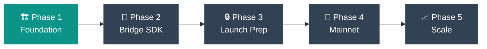

# Roadmap

From foundation to global scale — the Njord development journey.

---

## Development Phases

---

## Phase 1: Foundation *(Current)*

**Focus:** Core protocol development on Solana

- [x] Campaign Registry — create, fund, and manage campaigns
- [x] Affiliate Registry — registration, tier system, staking
- [x] Attribution Engine — event recording, validation, fraud scoring
- [x] Escrow Manager — fund custody and automatic distribution
- [x] Bridge Registry — operator onboarding, staking, reputation
- [x] Governance Module — token-weighted voting and proposals
- [x] NJORD SPL Token — staking rewards and governance
- [x] TypeScript SDK (`@njord/sdk`)
- [x] Deploy to Solana Devnet

---

## Phase 2: Bridge Infrastructure

**Focus:** Enable bridge operators to run fiat infrastructure

- [ ] Bridge operator SDK with payment gateway abstraction (`@njord/bridge-sdk`)
- [ ] Reference bridge implementation with Stripe and Razorpay
- [ ] CLI tools for bridge setup, staking, and monitoring
- [ ] Docker deployment scripts and Kubernetes manifests
- [ ] Comprehensive operator documentation and compliance guides

---

## Phase 3: Launch Preparation

**Focus:** Security, testing, and beta program

- [ ] Two independent smart contract security audits
- [ ] Beta program: 3–5 bridge operators, 10–20 companies, 50–100 affiliates
- [ ] Company dashboard and affiliate portal
- [ ] Event indexer with GraphQL API (`@njord/indexer`)
- [ ] Public website and campaign explorer
- [ ] Bug bounty program

---

## Phase 4: Mainnet Launch

**Focus:** Public launch and initial growth

- [ ] Token Generation Event (TGE) and DEX liquidity (Raydium, Orca)
- [ ] Mainnet contract deployment with multi-sig governance
- [ ] Bridge operator onboarding across 4+ regions
- [ ] Community building — Discord, Telegram, content
- [ ] Marketing and press coverage

---

## Phase 5: Growth & Expansion

**Focus:** Feature expansion and ecosystem growth

- [ ] Multi-touch attribution models and ML fraud detection
- [ ] E-commerce integrations (Shopify, WooCommerce, Magento)
- [ ] Mobile SDK (iOS/Android) and WordPress plugin
- [ ] Advanced analytics suite with cohort analysis and A/B testing
- [ ] On-chain governance UI with delegation system
- [ ] Additional payment methods (Apple Pay, Google Pay, BNPL)

---

## Milestones

| Milestone | Phase | Deliverable |
|-----------|-------|-------------|
| M1 | 1 | Core contracts on Devnet |
| M2 | 1 | SDK published |
| M3 | 2 | Bridge SDK published |
| M4 | 2 | Reference bridge running |
| M5 | 3 | Security audit complete |
| M6 | 3 | Beta program concluded |
| M7 | 3 | Frontend apps deployed |
| M8 | 4 | Token live on mainnet |
| M9 | 4 | Mainnet contracts deployed |
| M10 | 4 | 5+ bridges operational |
| M11 | 5 | Platform integrations live |
| M12 | 5 | 1M+ attributions processed |

---

## Success Metrics

| Phase | Target |
|-------|--------|
| **Launch** | 5+ bridge operators, 100+ campaigns, $100K+ monthly volume |
| **Growth** | 20+ bridge operators, 1,000+ campaigns, $10M+ monthly volume, 50,000+ affiliates |

---

## Related Pages

- [Tokenomics](tokenomics.md) — Token launch and economics
- [For Bridge Operators](for-bridge-operators.md) — Bridge onboarding
- [How It Works](how-it-works.md) — Protocol flow overview
