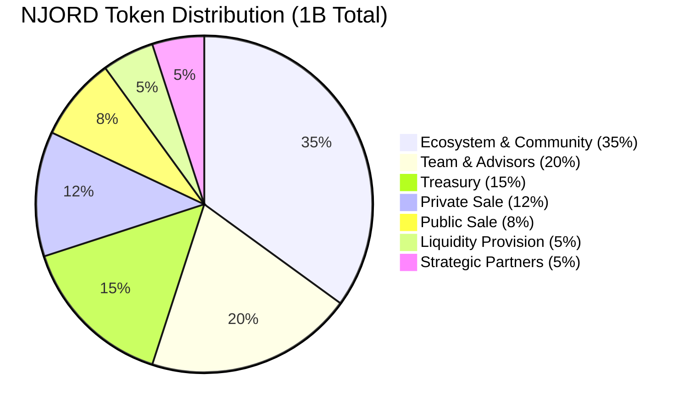
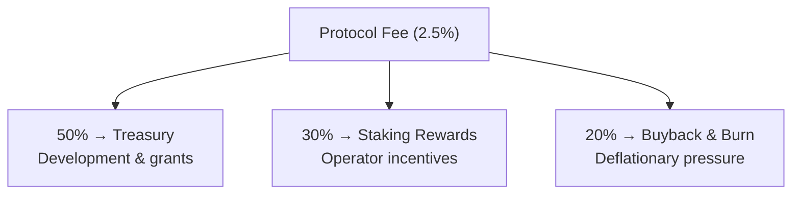
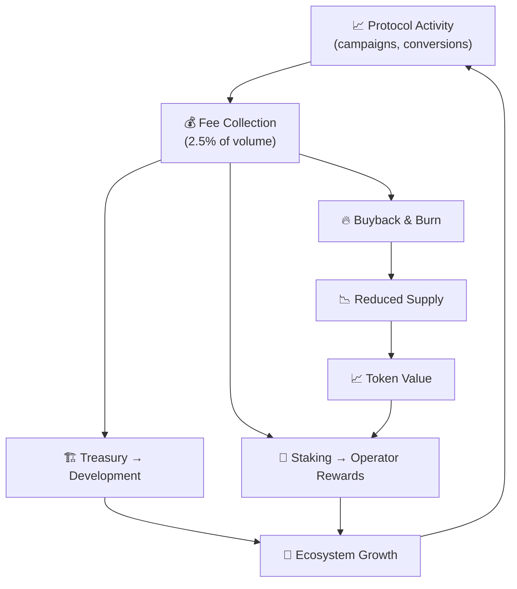

# Tokenomics

The NJORD token powers the Njord ecosystem — staking, governance, and fee discounts all in one.

---

## Token Overview

| Property | Value |
|----------|-------|
| **Token Name** | NJORD |
| **Blockchain** | Solana (SPL Token) |
| **Total Supply** | 1,000,000,000 (1 Billion) |
| **Decimals** | 9 |
| **Type** | Utility & Governance |

---

## Token Utility

### Bridge Staking
Bridge operators stake NJORD to participate in the network. Higher stakes unlock higher volume caps and better routing.

| Tier | Stake | Daily Volume |
|------|-------|-------------|
| Bronze | 10,000 NJORD | $10K |
| Silver | 50,000 NJORD | $100K |
| Gold | 200,000 NJORD | $1M |
| Platinum | 500,000 NJORD | Unlimited |

### Governance
NJORD holders vote on protocol parameters — fee rates, staking requirements, slashing rules, and upgrades.

- One token = one vote
- Platinum stakers can create proposals
- 3-day voting period, 24-hour timelock

### Fee Discounts
Companies stake NJORD for reduced campaign fees:

| Stake | Discount |
|-------|----------|
| 5,000 NJORD | 10% off |
| 25,000 NJORD | 25% off |
| 100,000 NJORD | 50% off |

---

## Token Distribution

| Allocation | Tokens | Vesting |
|-----------|--------|---------|
| Ecosystem & Community | 350M | 60-month allocation |
| Team & Advisors | 200M | 4-year vesting, 1-year cliff |
| Treasury | 150M | Governance controlled |
| Private Sale | 120M | 2-year vesting, 6-month cliff |
| Public Sale | 80M | No lock-up |
| Liquidity Provision | 50M | DEX pools |
| Strategic Partners | 50M | 18-month vesting, 3-month cliff |

---

## Fee Structure

### Protocol Fees

| Fee | Rate | Recipient |
|-----|------|-----------|
| Campaign creation | 0.1 SOL | Treasury |
| Attribution (protocol) | 2.5% of commission | Treasury + Stakers + Buyback |
| Attribution (bridge) | 1% of commission | Bridge Operator |

### Example Breakdown

> Customer purchases a $100 product with 10% commission:
>
> - Commission: **$10.00**
> - Protocol fee (2.5%): -$0.25
> - Bridge fee (1%): -$0.10
> - **Affiliate receives: $9.65**

---

## Fee Distribution

---

## The Flywheel

---

## Inflation Schedule

Controlled inflation funds staking rewards, offset by buyback & burn:

| Year | Inflation | Emission |
|------|-----------|---------|
| Year 1 | 5% | 50,000,000 NJORD |
| Year 2 | 4% | 40,000,000 NJORD |
| Year 3 | 3% | 30,000,000 NJORD |
| Year 4 | 2% | 20,000,000 NJORD |
| Year 5+ | 1% | 10,000,000 NJORD |

!!! info "Target: net-neutral or deflationary after Year 3"
    20% of protocol fees fund buyback & burn, creating natural demand tied to protocol usage.

---

## Governance Parameters

Token holders can vote on:

| Parameter | Current Value | Adjustable Range |
|-----------|--------------|-----------------|
| Protocol fee | 2.5% | 0.5% – 5% |
| Bridge minimum stake | 10,000 NJORD | 1,000 – 100,000 |
| Slashing rates | Variable | Per-offense |
| Inflation rate | Per schedule | ±1% per year |
| Fee distribution | 50/30/20 | Rebalanceable |

---

## Related Pages

- [For Bridge Operators](for-bridge-operators.md) — Staking tiers and revenue
- [For Companies](for-companies.md) — Fee discounts through staking
- [Fraud Protection](fraud-protection.md) — Slashing economics
- [Roadmap](roadmap.md) — Token launch timeline
